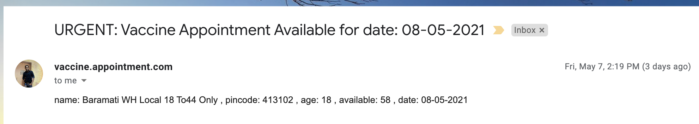

## COVID Vaccine Appointment Monitor - India [Work In Progress]
 
 - This project contains scheduler which runs every 10sec and does below job,
    - Call COVID appointment API and get the response
    ```
        -- Find availability using pincode
        https://cdn-api.co-vin.in/api/v2/appointment/sessions/calendarByPin?pincode=411001&date=08-05-2021
        
        -- Find availability using district code
        https://cdn-api.co-vin.in/api/v2/appointment/sessions/calendarByDistrict?district_id=363&date=07-05-2021
        
        -- more details about OpenAPI
        https://apisetu.gov.in/public/marketplace/api/cowin
    ```
    - Filter the vaccine centers which are having appointment availability
    - Trigger email with center details.
    
    
### Build

- You can build the project below command,

```bash
mvn clean install

# In case, you want to skip executing the tests,

mvn clean install -DskipTests
```

### Run in Local (In command line)

- Execute the below command after building the project successfully

```bash
java -jar target/covid-vaccine-appointment-monitor-1.0.0.jar
```

### Resource: application.properties

```bash
appointment.baseurl=https://cdn-api.co-vin.in/api/v2/appointment/sessions/
appointment.district.id=363
appointment.pincode=411057
appointment.age=18

# Mail Configuration
spring.mail.host=smtp.gmail.com
spring.mail.port=587
spring.mail.username=sankar****@gmail.com
spring.mail.password=*********
spring.mail.properties.mail.smtp.auth=true
spring.mail.properties.mail.smtp.starttls.enable=true
mail.smtp.debug=false
```
    